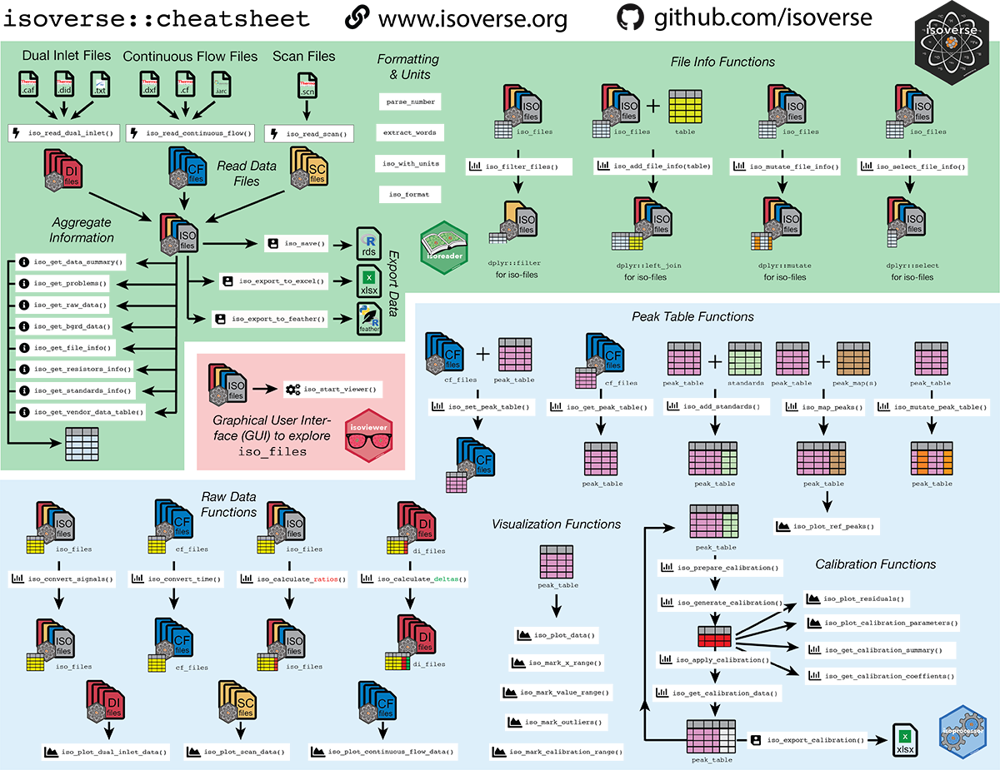

# isoverse cheatsheets

The cheat sheets provide a quick reference for key packages and
functionality in the isoverse. They are intended to make it easy to get
started and to find the right function names at a glance. Click on the
links below to download the PDF versions. The cheat sheets are released
under a creative commons license
([CC0](LICENSE.md)).

## isoverse cheatsheet\_draft

